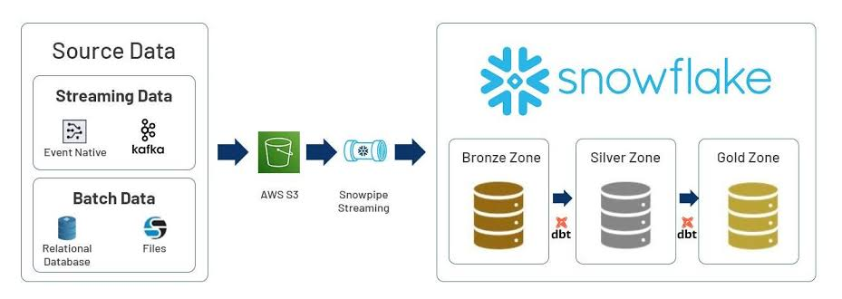

# Cloud Data Pipeline: API to Snowflake via AWS S3 & Airflow
An end-to-end, enterprise-grade Data pipeline orchestrating data extraction from REST APIs, staging raw files on **AWS S3**, ingesting and transforming data through a **Medallion Architecture** in **Snowflake**, fully automated using **Apache Airflow** and secured with **RSA Key-Pair Authentication**.

## Tech Stack & Prerequisites
* **Languages**: Python 3.10+
* **Orchestration**: Apache Airflow
* **Cloud Storage**: AWS S3
* **Data Warehouse**: Snowflake
* **Containerization**: Docker & Docker Compose

## Architecture

## Pipeline Components Breakdown

### 1. Data Source & Ingestion (`API -> AWS S3`)
* **Source Systems**: 
  * *Current (POOC)*: REST API JSON Payload.
  * *Target (Upcoming)*: Insurance Domain API / Mock Data Generator (Clients, Policies & Claims datasets).
* **Ingestion Logic**: A custom `PythonOperator` in Airflow queries the source endpoint, converts raw data to CSV in-memory via `pandas`, and streams it directly to an **AWS S3** raw landing zone using `S3Hook`.
* **Storage Standard**: Immutable partition format: `s3://<bucket_name>/raw/year/month/day/data_<timestamp>.csv`.

---

### 2. Snowflake Data Warehouse Architecture (Medallion Pattern)

The Data Warehouse is structured using the **Medallion Architecture** to guarantee data isolation, quality, and traceability across transformation stages.

#### Bronze Layer (`BRONZE_RAW` Schema)
* **Purpose**: Raw ingestion zone with schema-on-read capability.
* **Mechanism**: Executed via `COPY INTO` from the AWS S3 Stage `@S3_STAGE`.
* **Properties**: Append-only storage including metadata columns like `ingested_at = CURRENT_TIMESTAMP()`.

#### Silver Layer (`SILVER_CLEANED` Schema)
* **Purpose**: Enterprise data vault containing clean, typed, and deduplicated dimension and fact tables.
* **Transformation**: Uses SQL `MERGE INTO` statement combined with `ROW_NUMBER()` window functions over `ingested_at` to handle idempotent incremental upserts and deduplication.

#### Gold Layer (`GOLD_ANALYTICS` Schema)
* **Purpose**: Business-ready analytical aggregation layer (Data Marts).
* **Implementation**: Materialized Views and SQL Views providing ready-to-consume KPIs for decision-makers and BI tools.

---

### 3. Orchestration & Automated Data Quality (Airflow)

The entire flow is managed by an **Apache Airflow** DAG running inside Docker containers:

* **Task Dependencies**:
  `extract_api_to_s3` ➔ `load_s3_to_bronze` ➔ `transform_bronze_to_silver` ➔ `refresh_gold_layer`
* **Error Handling & Retries**: Automated retries with configurable delay (`timedelta`) for network resilience against external API or AWS/Snowflake connectivity hiccups.

---